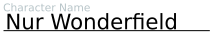

# Booktacular

- Edit Scribus sla project files.
- Make fillable SVG files such as from character sheet JSON files.
- Automate Scribus.
- Automate PDF utilities to make publishable documents and books
  - pstill: convert to old PDX X/1-a format required by major print-on-demand publishers.
  - pdftoppm: Update book cover images at website resolution automatically from a high-dpi book cover.

## Examples
- [scripts](scripts) folder
- [booktacular/sheetfiller.py](booktacular/sheetfiller.py)\
  
- Hierosoft [e1p-character-sheet-for-pf2](https://github.com/Hierosoft/e1p-character-sheet-for-pf2): Efficient 1-Page Character Sheet for PF2 (Python-fillable form is pre-alpha)

## Related Projects
- Hierosoft [PrintableTabletopMappingKit](https://github.com/Hierosoft/PrintableTabletopMappingKit): Negative space drawing kit for Tiled Map Editor (3 layers, so you can simply draw the ground through the rock/wall and the grid will be uncovered; simple shapes are available too: symbolic benches, tables, circles for pillars, etc).
- Hierosoft [tabletopManualMiner](https://github.com/Hierosoft/tabletopManualMiner): Convert the SRD 5 rules PDF to metadata.